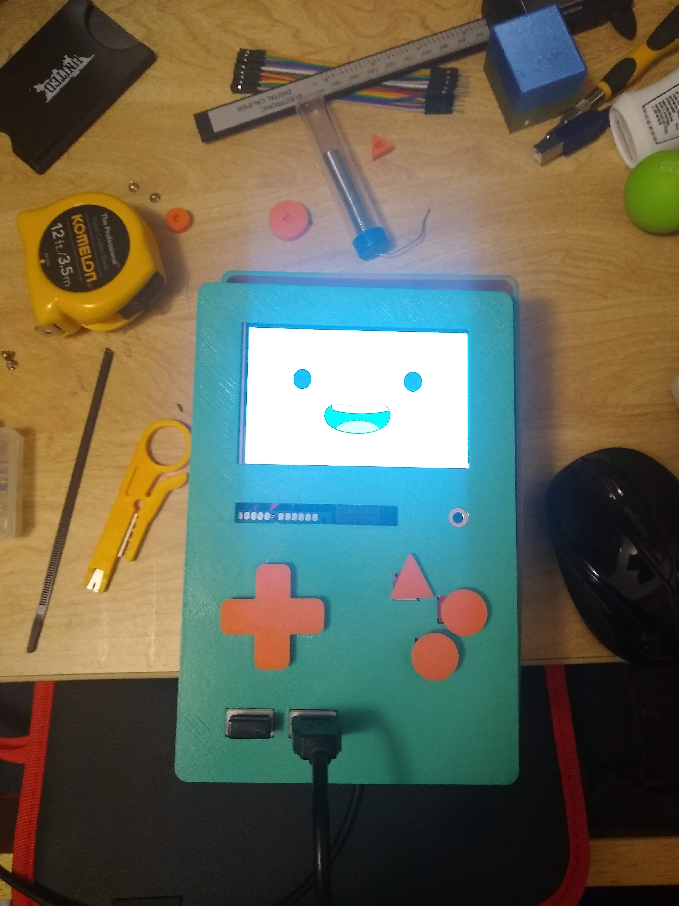

# The MoFactory
Welcome to the MoFactory! A project with the goal of making a real and functioning BMO from the show adventure time! The side goal in doing so is to learn as much as possible about design, electronics, project management and more. All files are open source so you can build one for yourself and/or contribute to the project too. Now with all that said, "Who wants to play video games?"

## Contents

- [Contributing](#contributing)
- [About BMO](#about-bmo)
    - [Hardware specs](#hardware-specs)
    - [Software structure](#software-structure)
- [Building BMO](#building-bmo)
    - [Hardware](#hardware)
        - [Bill of Materials](#bill-of-materials)
        - [Build Instructions](#build-instructions)
    - [Software](#software)
        

## Contributing

## About BMO

### Hardware Specs

### Software Structure

## Building BMO
### Hardware
#### Bill of Materials
The follwing are the parts I used in the build. Since I wanted to use components I already had instead of buying everything, some things might be harder to find or
may be less efficient than other components, for example I used a power bank I had lying around instead of getting a LiPo battery which would have been lighter and
possibly take up less space.

That said, I'll try to add links to everything I used so it's easier to follow the build process:

- [ ] Screen - [Waveshare 4inch HDMI LCD Resistive Touch Screen](https://www.amazon.com/gp/product/B01M69DK1A/ref=ppx_yo_dt_b_asin_title_o05_s01?ie=UTF8&psc=1) 
- [ ] Brain - Raspberry Pi 3b + 64GB micro sd card 
- [ ] Microphone - [Sunfounder USB 2.0 Mini Microphone](https://www.amazon.com/gp/product/B01KLRBHGM/ref=ppx_yo_dt_b_asin_title_o03_s01?ie=UTF8&psc=1) 
- [ ] Speaker - [HONKYOB USB Mini Speaker](https://www.amazon.com/dp/B075M7FHM1/?coliid=IDTUA3JBRH8S4&colid=1KIUQQ2ZXBD56&ref_=lv_ov_lig_dp_it&th=1) 
- [ ] [Earphone Jack extension ](https://www.amazon.com/gp/product/B089GZL7K6/ref=ppx_yo_dt_b_asin_title_o03_s00?ie=UTF8&psc=1) 
- [ ] [Left angle USB Extension cable 2-pack](https://www.amazon.com/gp/product/B01M1KKLS7/ref=ppx_yo_dt_b_asin_title_o03_s00?ie=UTF8&psc=1) 
- [ ] [Right angle USB Extension cable 1-pack](https://www.amazon.com/gp/product/B01M1KAMGG/ref=ppx_yo_dt_b_asin_title_o02_s00?ie=UTF8&psc=1) 
- [ ] [Spray paint](https://www.amazon.com/gp/product/B07LFXCKMP/ref=ppx_yo_dt_b_asin_title_o02_s01?ie=UTF8&psc=1) or
- [ ] [Aquamarine PLA filament](https://www.amazon.com/Standard-Printing-Filament-Dimensional-Aquamarine/dp/B08L8CYS1H/ref=sr_1_2?dchild=1&keywords=aqua+filament+pla&qid=1627584282&sr=8-2)
- [ ] [Tactile Push Buttons](https://www.amazon.com/gp/product/B01NCQVGLC/ref=ppx_yo_dt_b_asin_title_o02_s01?ie=UTF8&psc=1) 
- [ ] [PCB prototype board](https://www.amazon.com/gp/product/B072Z7Y19F/ref=ppx_yo_dt_b_asin_title_o02_s00?ie=UTF8&psc=1) 
- [ ] [HDMI adapter](https://www.amazon.com/gp/product/B08J8BJQLB/ref=ppx_yo_dt_b_asin_title_o01_s00?ie=UTF8&psc=1) 
- [ ] [Dupont Jumper cables male to female](https://www.amazon.com/gp/product/B07GD17ZF3/ref=ppx_yo_dt_b_asin_title_o03_s00?ie=UTF8&psc=1) 
- [ ] [Ultralink 10000mah power bank](https://www.guzzle.co.za/specials/view/1075115/) 
- [ ] Micro USB cable X2 - one to power the pi and one to charge the powerbank

Here are the tools I used when prototyping/building:

- [ ] 3D Printer - I use a Creality Ender-5 Pro but if you don't have access to a 3D printer, there are several online services you could try
- [ ] Soldering iron 
- [ ] Hot glue gun
- [ ] Super glue
- [ ] Screwdriver
- [ ] mask (for spray painting)
- [ ] Zip ties (for cable management) 
- [ ] Acrylic paint and paintbrush (to paint the directional and action buttons)

#### Build Instructions
Okay, now that all the tools and parts are in place, we can get started on the build. (NOTE: If you are using different parts than listed above, you may want ot double check that the dimensions of your parts are similar, otherwise they may not fit. If you want to build a bmo completely from scratch click here for instructions (link coming soon))

##### Print the parts
First, we need to print out the casing that will make up BMO's body. You can find the files in the "hardware" folder. If you don't have access to a 3D printer, you might be able to find some services online that can print and deliver them too you.
We'll use PLA and can keep the default settings (20% infill). There are 6 files to print:

- face: BMO's front plate

- back: the backplate

- body:

- d-pad:

- action buttons: 

- BMO Typography: This is a stencil to use to paint "BMO" on the sides

##### Spray Painting
If you used the Aquamarine filament when printing, you can skip this step. 
Make sure to paint outside or in a well ventilated room, and don't forget to wear a mask.
Each part should get 2-3 coats of paint, so switch between parts while waiting for one to dry.
I had acrylic paint lying around so I used that to paint the buttons.

##### Fitting in the screen
- The screen fits snugly in the groove on the back of the face part. If you are using the same screen as listed, it comes with mounting screws that you can use to mount the screen in the back of the face part. Be careful when doing this as lcd screens are fragile. Also try to make sure that the screws are straight when screwing, otherwise it will pull the screen and make it harder to screw in the opposite screws.

- you can connect the hdmi cable to the screen and bend the cable acouple of times to make it more flexible.

##### Adding the buttons
- For this step we will need the push buttons, the pcb board, jumper wires and a soldering gun. In order to fit in the case you will need the 4x6cm board for the directional buttons and the 3x7cm board for the action buttons. The push buttons have two pins we will use, one which we can connect all to the same point will provide power while the other will each connect to their own pin on the pi so we can tell what button is being pressed.

- The buttons fit very snugly in the pcb board so the first step will be arranging them on the board. For the directional buttons, we'll place the buttons in the center of the 4*6cm board, leaving a clear row in at least one of the ends of the board.

- The buttons are arranged such that the inner corners are just nearly touching each other and that none of the pins are facing the center of the board (see picture for reference). To make sure that the buttons will fit, you can grab the face part or d-pad and ensure that the buttons fit in the part.

- Once that is done, the next part is to solder the ground cable. Get a male to male dupont cable and connect it to the top pin at the end of the board that you left clear in the first step. It's a loose fit, so you will need to solder the cable in place. Make sure the cable is pointing away from the buttons (as shown in the picture)

- Next we'll need to add a resistor to the circuit which will limit the amount of current flow. Add it next to the cable that was just soldered and solder one end of the resistor to the cable.

- Next we will add a cable in the same row as the resistor, soldering their ends passing the wire next to one of the pins of the button. Solder these points too and repeat for the remaining 3 buttons (see picture for reference)

- Once there is a cable connecting each button to the power line, we add cables and solder them to the adjacent pins on the buttons. We'll leave the ends sticking out for now and connect them to the pi in a later step. (see picture for reference)

- We will repeat the process for the action buttons. Using the 3x7cm board we will place the buttons in the center. The button placement isn't as uniform as with the directional buttons so we will use the face part to make sure the alignment is correct (see picture for reference).

- All the other steps involving soldering are the same as the previous steps. (remember to refer to the images for reference)

##### Adding the speaker
- We're actually going to need to remove the speaker from its casing. There are speaker modules you can buy and add an amplifier to but at the time I thought this might be a simpler solution. That and I wasn't sure how that worked. Definitely something I could improve later.

- Removing the speaker is easy enough as it is just unscrewing the case, however to remove the usb cable you may have to break the casing. I found using pliers was helpful but be careful not to hurt yourself with the plastic pieces. Another option would be to cut the wires on the speaker and resolder them after pulling the cable from the casing.

- But once that is done, you can connect the usb to the right-angled usb adapter. This will connect to the upper right usb port on the raspberry pi

- The speaker should fit snuggly on the left side of the body part. The padding should help with this though you may have to exert a little bit of force. If it is not secure or falls out don't worry, we'll be gluing it in in a later step.

##### Adding the Mic
- Grab the mic and fit it in one of the lower right usb ports.

##### Adding the USB Ports
- Add the left-angle usb adapters to the upper and lower left usb ports. These will go to usb port at the bottom of the face part. They should be a snug fit but we will glue it in a later step

##### Adding the earphone jack
- Connect the earphone adapter to the earphone jack. We will glue it to the earphone port on the face part in the next step.

##### Bringing it all together
- Okay, we are ready to glue everything in. We will want to use the glue gun as it will help gluing in parts that aren't completely flat.

- First, let's glue the buttons, specifically, the board to the face part. Press the board to the face part and place glue on the buttons closer to the edges of the board, careful not to stop the button from being pressed. Next reinforce the board by gluing the corners of the board to the face part. You may need to use a generous amount to ensure it's secure.
- A future improvement could be to use screws to mount them to the face part, but for now we will make do.

- Next we'll glue the two left-angle usb ports to the face part. Be sure to push the usb adapters until the ends are flush with the front of the face part, then add glue to secure it in place.

- We will do the same with the earphone jack. It may be a too tight to go all the way but so long as your earphones can still connect you should be fine. (I used a box cutter to carve a bit more wiggle room). 

- Next we will glue the speaker in the slot, adding the glue to the outer edges.

- Now we can connect the button cables to the pi. The power wires will go to the 3.3v pins on the pi (pins 1 and 17), then the rest will follow this configuration:
    up = pin 13
    down = pin 15
    left = pin 16
    right = pin 11
    green button = pin 18
    red button = pin 31
    blue buton = pin 29
- You can also connect the hdmi cable

- The final peice to glue will be the face part to the body. For this part we will use super glue. Add the glue to the edges of the front piece and then press to the body piece for a few minutes till it's firm. You can place it face down so you won't have to hold it the whole time. Just be careful for the screen, we know how many times BMO has cracked his face :)

- Once the glue is all set we can add the button parts which should fit fine without any glue.

- We are just about done! Next let's add some batteries!

##### Adding the battery
- As mentioned earlier, I was trying to use as many parts I already had lying around and so it turns out the powerbank I used is not very common to get (Unless you are in South Africa). Have no fear though, we should be able to use any other powerbank, just make sure it has:
- [ ] 5V 2A output
- [ ] not much bigger than 25mm x mm x 120mm (these were the dimensions of mine)
- [ ] If it has an 'on' button, you can access it after fitting it in.

- I ended up not gluing the back so that I can still access it when needed. Perhaps in the future I will try it with Lipo batteries. 
- But after all that, we are done!!

### Software
